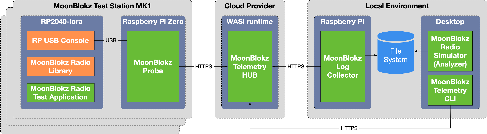

# MoonBlokz Test Station Infrastructure – Detailed Module Specifications

This document consolidates the draft specifications for all four pieces of the
MoonBlokz test environment (probe, telemetry hub, log collector and CLI)
into a coherent system design. The goal is that an implementation team can use
these specifications to develop interoperable components.

## Table of contents

1. [Architecture overview](#architecture-overview)
2. [MoonBlokz Probe](#moonblokz-probe)
   1. [Purpose](#purpose)
   2. [Configuration](#configuration)
   3. [Processes](#processes)
   4. [Internal data structures](#internal-data-structures)
   5. [Telemetry upload API](#telemetry-upload-api)
   6. [Firmware and self‑update](#firmware-and-self-update)
   7. [Error handling and security](#error-handling-and-security)
3. [Telemetry HUB](#telemetry-hub)
   1. [Purpose](#purpose-1)
   2. [Runtime environment and variables](#runtime-environment-and-variables)
   3. [Data storage model](#data-storage-model)
   4. [HTTP API](#http-api)
   5. [Command processing and scheduling](#command-processing-and-scheduling)
   6. [Data retention and cleanup](#data-retention-and-cleanup)
   7. [Security considerations](#security-considerations)
4. [MoonBlokz Log Collector](#moonblokz-log-collector)
   1. [Purpose and environment](#purpose-and-environment)
   2. [Configuration](#configuration-1)
   3. [Download protocol](#download-protocol)
   4. [Log file format](#log-file-format)
   5. [Error handling](#error-handling)
5. [Telemetry CLI](#telemetry-cli)
   1. [Purpose and environment](#purpose-and-environment-1)
   2. [Configuration](#configuration-2)
   3. [Command grammar](#command-grammar)
   4. [Command submission API](#command-submission-api)
   5. [Interactive behaviour](#interactive-behaviour)
   6. [Error handling](#error-handling-1)
6. [Data model and JSON schemas](#data-model-and-json-schemas)
7. [Cross‑cutting concerns](#cross-cutting-concerns)

---

## Architecture overview

MoonBlokz Test Infrastructure is an end‑to‑end test harness for the
MoonBlokz radio subsystem. It consists of a LoRa radio node based on the
RP2040 microcontroller and four software components connected via HTTPS:

* **MoonBlokz Probe** – running on a Raspberry Pi Zero attached via USB to
  the RP2040 node.  It ingests log lines from the node, buffers them, and
  periodically uploads them to the **Telemetry HUB**.  The probe also
  executes management commands received from the hub and can update the
  node’s firmware or its own binary.
* **Telemetry HUB** – a WASI/WASM service deployed in a cloud provider
  (e.g. Fermyon Cloud).  It receives log batches from probes and stores
  them, serves log downloads to the **Log Collector**, and accepts
  management commands from the **Telemetry CLI**.  It manages command
  scheduling and deletion of old data.
* **Log Collector** – a command‑line program that periodically fetches
  newly available log entries from the hub and writes them to a local file
  for offline or online analysis.
* **Telemetry CLI** – a command‑line tool that allows an operator to
  remotely issue commands (change log level, start firmware updates,
  reboot) for individual nodes or all nodes via the hub.

The diagram below shows the major components and data flows.  The RP2040
radio test application sends its logs over USB to the probe, which
forwards them to the hub.  The log collector periodically downloads
aggregated logs and writes them to a file system; the CLI sends commands
to the hub, which delivers them to probes on their next upload.  All
communications between components outside the same host use HTTPS.



---

## MoonBlokz Probe

### Purpose

The probe is a headless Rust daemon (starts automatically whern Pi Zero reboots) 
that runs on a Raspberry Pi Zero and acts as the bridge between a MoonBlokz RP2040 
node and the telemetry infrastructure.  Its responsibilities are:

1. **Log ingestion:** Read log lines from the node’s USB serial console,
   timestamp them and filter them according to a dynamic filter string.
2. **Buffering:** Maintain an in‑memory queue of recent log entries
   subject to a maximum buffer size.  When the network is unavailable or
   the hub returns non‑success responses, the probe retains unsent logs
   for later delivery.
3. **Periodic upload:** Assemble buffered logs into a batch and send
   them to the telemetry hub via an HTTPS POST.  The hub may include
   commands in its response; the probe executes them.
4. **Command execution:** Execute supported commands (change log level,
   update filter, arbitrary node commands, firmware update, probe
   self‑update, reboot) issued by the hub.
5. **Firmware management:** Detect new firmware versions for both the
   RP2040 node and the probe itself, download and verify them and
   perform the update sequence.

### Configuration

The probe reads configuration from a `config.toml` file whose path can be
overridden via the `--config` command‑line option. Key settings include:

| Config key | Type | Description |
| --- | --- | --- |
| `usb_port` | `string` | Path to the USB serial port (e.g. `/dev/ttyACM0`). |
| `server_url` | `string` | Fully qualified URL of the telemetry hub.  |
| `api_key` | `string` | Shared secret used in the `X‑Api‑Key` header of all requests. |
| `node_id` | `u32` | Unique identifier for this node (e.g. 21). |
| `node_firmware_url` | `string` | Base URL for node firmware (without the ending: `/version.json`). |
| `probe_firmware_url` | `string` | Base URL for probe firmware (without the ending: `/version.json`). |
| `upload_interval_seconds` | `u64` (optional) | Interval between telemetry uploads in seconds; defaults to 300. |
| `buffer_size` | `usize` (optional) | Maximum number of log entries to hold in memory; defaults to 10 000. |
| `filter_string` | `string` (optional) | Initial substring filter; an empty string means no filtering. |

### Processes

#### Main event loop

The probe uses the Tokio runtime. The working model is async, with select operations where applicable (and without mutexes).
The application uses idiomatic Rust patterns and avoid cloning if it is possible.
The main loop schedules the following concurrent tasks:

1. **USB log collector:** Connect to the serial port specified by
   `usb_port` and read lines continuously.  Upon connection loss, retry
   with exponential back‑off.  The probe prepends a UTC timestamp in
   ISO 8601 format (e.g. `2025‑10‑23T18:00:00Z`) and enqueues the
   resulting log entry if it matches `filter_string` (case sensitive).
   If the buffer reaches `buffer_size`, the oldest entries MUST be
   dropped to make room for new ones.

2. **Telemetry sync task:** Wake up at `upload_interval_seconds`
   intervals and send a batch of buffered logs (may be empty) to the
   telemetry hub.  If the upload fails (non‑2xx status, network error
   or parsing error), the probe MUST retain unsent logs and retry on
   the next interval.  On success, remove the sent logs from the
   buffer and process any commands from the response (see below).

3. **Update managers:** Two update tasks monitor firmware versions and
   perform updates when triggered either at startup or via commands.
   The node update task checks the version at
   `${node_firmware_url}/version.json`, compares it with the current
   version installed on the RP2040 (inferred from the `.uf2` file name
   in a `deployed/` directory), downloads and verifies the new UF2
   image, copies it to the bootloader disk after putting the node
   into bootloader mode, and then records the new version.  The
   probe self‑update task performs a similar process for the probe
   binary itself, updating the `start.sh` script and triggering a
   reboot.

#### Command execution

The telemetry hub may return a JSON array of commands in the body of a
successful upload response.  Each command is an object with a
`command` field and a `parameters` field.  The probe MUST parse the
commands sequentially and execute them synchronously between
uploads.  Supported commands are shown below; any unknown command MUST
be logged and ignored.

| Command | Description | Parameters | Action |
| --- | --- | --- | --- |
| `set_update_interval` | Modify the probe’s upload schedule. | `start_time`, `end_time`, `active_period`, `inactive_period` (all ISO 8601 timestamps or integers in seconds). | The probe MUST adjust its upload interval such that it uses `active_period` seconds during the specified window and `inactive_period` seconds otherwise. |
| `set_log_level` | Change verbosity on the RP2040 node. | `level` ∈ {`TRACE`,`DEBUG`,`INFO`,`WARN`,`ERROR`}. | Send the corresponding command over USB (`/LT`, `/LD`, `/LI`, `/LW` or `/LE`, followed by CRLF). |
| `set_filter` | Update the in‑memory substring filter. | `value` – new filter string. | Set `filter_string = value`; flush existing buffer if desired. |
| `run_command` | Execute an arbitrary USB command on the node. | `value` – raw command string. | Send `value` followed by CRLF over the serial port. |
| `update_node` | Trigger node firmware update. | none | Schedule the node update manager to execute immediately. |
| `update_probe` | Trigger probe self‑update. | none | Schedule the probe update manager to execute immediately. |
| `reboot_probe` | Reboot the Raspberry Pi. | none | Call `sudo reboot` (requires passwordless sudo). |

### Internal data structures

Internally the probe represents each log entry as:

```rust
/// A single log entry captured from the RP2040.
struct LogEntry {
    timestamp: String,   // ISO 8601 UTC timestamp
    message: String,     // original log line including [LEVEL]
}

```

Timestamps MUST be recorded in UTC regardless of the local time zone and
encoded using RFC 3339/ISO 8601 with a trailing `Z`.

### Telemetry upload API

The probe sends log batches to the hub’s `/update` endpoint.  Requests
and responses are defined as follows.

#### Request

* **Method:** `POST`
* **URL:** `{server_url}/update`
* **Headers:**
  * `Content-Type: application/json`
  * `X‑Node‑ID: <node_id>` – unique identifier of this node.
  * `X‑Api‑Key: <api_key>` – shared secret for authentication.
* **Body:** JSON object with one property `logs` containing an array of
  log entries.  Each entry MUST have a `timestamp` (string) and a
  `message` (string) field.  The order of entries SHOULD be ascending
  by time.

Example:

```json
{
  "logs": [
    {
      "timestamp": "2025‑10‑23T18:00:00Z",
      "message": "[INFO] Node initialised"
    },
    {
      "timestamp": "2025‑10‑23T18:00:05Z",
      "message": "[DEBUG] Packet received from peer"
    }
  ]
}
```

#### Response

* **HTTP status:** `200 OK` indicates success and may include a command
  array.  `4xx` denotes client errors (e.g. authentication failure);
  `5xx` denotes server errors.  On non‑200 status the probe MUST retain
  the uploaded logs and retry later.
* **Body (for 200):** JSON array of zero or more commands.  See the
  “Command execution” table above.  After parsing, the probe MUST
  remove the returned logs from its buffer and persist the new
  schedule parameters (if applicable).

### Firmware and self‑update

Two asynchronous tasks manage firmware updates:

#### Node firmware update

1. Fetch `version.json` from `${node_firmware_url}/version.json` and
   parse it; the file MUST contain `version` (integer) and `crc32`
   (string) fields.
2. Determine the currently deployed version by inspecting the UF2 file
   name in a `deployed/` directory (e.g. `moonblokz_104.uf2` => 104).
3. If `latest_version > current_version`, download the UF2 from
   `${node_firmware_url}/moonblokz_<latest_version>.uf2` to a
   temporary location.
4. Compute the CRC‑32 checksum of the downloaded file and compare it
   with the expected value.  Abort on mismatch.
5. Send `/BS\r\n` to the node to enter bootloader mode, wait until a
   USB mass‑storage device appears and mount it (requires privileges).
6. Copy the UF2 file to the mounted volume.  The device will reboot
   automatically.  Unmount and remove the temporary file.
7. Move the new UF2 into `deployed/` and remove old versions.  Update
   internal state so future checks know the new version.

#### Probe self‑update

1. Fetch `${probe_firmware_url}/version.json` containing `version`
   (integer) and `checksum` (CRC-32) fields.
2. Determine the running version from the filename of the binary in
   `deployed/` (e.g. `moonblokz_probe_105`).
3. If newer, download `moonblokz_probe_<version>` from the same base
   URL, verify its checksum, set the executable bit and atomically
   replace the old binary in `deployed/`.
4. Update `start.sh` to invoke the new binary with the current
   configuration file:

   ```bash
   #!/bin/bash
   # Auto‑generated start script
   exec /path/to/deployed/moonblokz_probe_<version> --config /path/to/config.toml
   ```

5. Reboot the Raspberry Pi using `sudo reboot` (requires passwordless
   privileges) to start the new version.  The update manager MUST
   capture and log failures and retry later.

### Error handling and security

* **USB disconnection:** the probe SHOULD attempt to reconnect with
  exponential back‑off.  During disconnection the buffer continues to
  accept logs from previous iterations but will eventually fill and
  discard old entries.
* **Network failures:** on failed uploads (timeout, TLS failure,
  DNS error, non‑200 status) the probe MUST retain unsent logs and
  retry on the next scheduled upload.  It SHOULD log the error and
  increment an exponential back‑off if successive attempts fail.
* **Malformed server responses:** if the response body cannot be
  parsed as JSON or does not match the expected schema, the probe
  MUST log an error and ignore the response; the uploaded logs are
  still considered delivered if the status is 200.
* **Security:** all communications use HTTPS with TLS 1.2 or later.
  The probe MUST validate TLS certificates.  API keys MUST be kept
  secret and never logged.  For privileged operations (mounting
  filesystems and rebooting) the system administrator MUST configure
  `sudoers` to allow only the required commands without a password.

---

## Telemetry HUB

The telemetry hub is a stateless cloud service implemented as a WASI
module using the Spin framework.  It accepts uploads from probes,
stores log messages, supplies them to log collectors (multiple log collectors can run simultaneously), and manages
commands issued by operators through the CLI.  It enforces security via
API keys and performs periodic cleanup of old data. The HUB uses
idiomatic Rust patterns and avoid cloning if it is possible.

### Runtime environment and variables

The hub is configured via `spin.toml` variables:

| Variable | Description |
| --- | --- |
| `probe_api_key` | API key shared by all probes.  Each `/update` request MUST include this value in the `X‑Api‑Key` header. |
| `log_collector_api_key` | API key used by the log collector.  Required in the `X‑Api‑Key` header of `/download` requests. |
| `cli_api_key` | API key used by the CLI.  Required in the `X‑Api‑Key` header of `/command` requests. |
| `delete_timeout` | Number of minutes after which old log and command records are deleted.  Default recommended value is 30 minutes. |
| `default_upload_interval` | Default telemetry upload interval (in seconds) used to compute log delivery delays. |

### Data storage model

The hub uses both SQLite and a key‑value store provided by the Spin
runtime.  SQL is used for structured data and the KV store holds small
state variables.

#### SQLite tables

```sql
CREATE TABLE IF NOT EXISTS log_messages (
    id         INTEGER PRIMARY KEY AUTOINCREMENT,
    timestamp  TEXT NOT NULL,
    node_id    INTEGER NOT NULL,
    message    TEXT NOT NULL
);

CREATE TABLE IF NOT EXISTS commands (
    id         INTEGER PRIMARY KEY AUTOINCREMENT,
    timestamp  TEXT NOT NULL,
    node_id    INTEGER NOT NULL,
    command    TEXT NOT NULL
);
```

* `log_messages` stores every log entry delivered by probes.  The
  `timestamp` field is a string in ISO 8601 format; `node_id` is the
  probe’s `X‑Node‑ID` header value; `message` is the full log line.
* `commands` stores pending commands for probes.  The `command` field
  contains a JSON object encoded as a string; `node_id` identifies the
  target probe.  When a probe retrieves its commands, the hub deletes
  the corresponding rows.

#### Key–value store keys

* `last_delete_time` – timestamp (ISO 8601) of the last cleanup run.
* `max_upload_interval` – maximum of all configured update intervals.  It
  is updated whenever a `set_update_interval` command is processed for
  any node.  This value is used to determine when a log entry is
  considered “old enough” to deliver to the collector (see
  *Data retention* below).

### HTTP API

The hub exposes three endpoints: one for probes to upload logs and
retrieve commands, one for log collectors to download buffered logs,
and one for CLI clients to enqueue commands.

#### 1. `/update` – Probe upload and command retrieval

* **Method:** `POST`
* **Headers:**
  * `X‑Api‑Key: <probe_api_key>` – required.  Requests with an
    incorrect key MUST receive `401 Unauthorized`.
  * `X‑Node‑ID: <node_id>` – required.  Identifies the probe; if missing,
    the hub MUST respond with `400 Bad Request`.
* **Body:** JSON object with a `logs` property containing an array of
  log entries with `timestamp` and `message` fields.  The hub MUST
  iterate through all log entries and insert each into `log_messages`
  with `node_id` equal to the header value.  The hub SHOULD use a
  single transaction for efficiency.
* **Process:**
  1. Validate the API key and node ID.
  2. Save each log entry to the database.  Invalid entries (missing
     fields) MUST cause a `400 Bad Request`.
  3. If more than `delete_timeout` minutes have elapsed since
     `last_delete_time`, purge from both `log_messages` and `commands`
     all rows whose `timestamp` is older than
     `now − delete_timeout` and update `last_delete_time`.
  4. Retrieve all pending commands for this `node_id` from
     `commands`, return them as a JSON array in the response body
     (preserving the order of insertion) and delete them from the
     table.
  5. Return `200 OK` with the command array.  For security, the hub
     MUST never include commands intended for other nodes.

* **Errors:**
  * `401 Unauthorized` if API key does not match `probe_api_key`.
  * `400 Bad Request` if required headers or body are missing/malformed.
  * `500 Internal Server Error` for unexpected failures; the probe
    SHOULD retry on a subsequent upload.

#### 2. `/download` – Log collector download

* **Method:** `GET`
* **Query parameters:**
  * `last_log_message_id` – integer ID of the last log message that
    the collector has already processed.  The parameter MUST be present;
    the collector uses 0 for the first request.  Requests with
    negative or non‑numeric values MUST receive `400 Bad Request`.
* **Headers:**
  * `X‑Api‑Key: <log_collector_api_key>` – required.  Requests with an
    incorrect key MUST receive `401 Unauthorized`.
* **Process:**
  1. Validate API key and `last_log_message_id`.
  2. Look up `max_upload_interval` in the key‑value store (defaulting
     to `default_upload_interval`).  Compute `cutoff_time = now −
     max_upload_interval × 1.1`.  The factor of 1.1 introduces a
     safety margin for network delays.
  3. Query `log_messages` for rows with `id > last_log_message_id` and
     `timestamp < cutoff_time`, sorted by ascending `id`.  Limit the
     number of rows returned (e.g. 10 000) to avoid excessively large
     responses.
  4. Return a JSON object with a `logs` array.  Each entry includes
     `item_id` (database row ID), `timestamp` (string), `node_id` and
     `message`.

Example response:

```json
{
  "logs": [
    {
      "item_id": 42,
      "timestamp": "2025‑10‑23T17:59:50Z",
      "message": "[INFO] Node initialised"
    },
    {
      "item_id": 43,
      "timestamp": "2025‑10‑23T18:00:05Z",
      "message": "[DEBUG] Packet received from peer"
    }
  ]
}
```

* **Errors:**
  * `401 Unauthorized` if API key is invalid.
  * `400 Bad Request` if `last_log_message_id` is missing or invalid.
  * `500 Internal Server Error` on database or unexpected errors.

#### 3. `/command` – CLI command submission

* **Method:** `POST`
* **Headers:**
  * `X‑Api‑Key: <cli_api_key>` – required; invalid keys produce
    `401 Unauthorized`.
* **Body:** JSON object with `command` and `parameters`.  See the
  [Telemetry CLI](#telemetry-cli) section for the grammar and mapping to
  JSON.  `parameters` MAY omit `node id` to target all nodes.
* **Process:**
  1. Validate API key.
  2. Extract `command` and `parameters`.  Ensure required fields for the
     specific command are present and types are correct; otherwise
     return `400 Bad Request`.
  3. If `node id` is specified, insert a row into `commands` with
     `node_id = <node id>` and `command = <body string>` (the body
     string should be the original JSON object).  If `node id` is
     absent, query all distinct `node_id` values from `log_messages` and
     insert one row per node.
  4. If the command is `set_update_interval`, update `max_upload_interval`
     in the key‑value store: if targeting a specific node, update
     `max_upload_interval` to the maximum of its current value and the new interval;
     otherwise set `max_upload_interval` directly to the new interval.
  5. Return `200 OK` on success.

* **Errors:**
  * `401 Unauthorized` if API key is invalid.
  * `400 Bad Request` if payload is missing required fields or has
    unknown command names or invalid parameter types.
  * `500 Internal Server Error` on database errors.

### Command processing and scheduling

The hub does not execute commands itself; instead it stores them until
the corresponding probe retrieves them via `/update`.  Each probe polls
the hub on its own schedule, so commands experience at most one upload
interval of latency.  Commands are deleted from the database once
delivered, ensuring idempotence.

### Data retention and cleanup

To prevent unbounded growth of the database, the hub performs periodic
cleanup.  The cleanup logic runs within the `/update` handler (to avoid
creating separate timers in the WASI environment).  On each call,
`current_time` is compared with `last_delete_time`.  If the delta is
greater than `delete_timeout` minutes, the hub deletes from both
`log_messages` and `commands` all rows where `timestamp < current_time -
delete_timeout`.  After deletion, `last_delete_time` is updated.  The
value of `delete_timeout` MUST be configurable via `spin.toml`.  

### Security considerations

* All endpoints MUST be served over HTTPS; the Spin environment handles
  TLS termination.  Plain‑HTTP requests MUST be rejected or redirected.
* API keys MUST be random strings of sufficient entropy (32 bytes or
  more) and stored securely.  
* The hub MUST validate all incoming data for correct types and
  reasonable sizes to prevent SQL injection or resource exhaustion.  An
  upper limit on `logs` array length (e.g. 10 000 entries) SHOULD be
  enforced.
* Each probe’s `node_id` SHOULD be unique.  The hub does not strictly
  verify uniqueness but uses `node_id` as the primary key for
  per‑node state.

---

## MoonBlokz Log Collector

### Purpose and environment

The log collector is a command‑line application written in Rust (Tokio
optional).  It runs on a local device (Raspberry Pi, desktop or server)
and periodically downloads new log items from the telemetry hub and
appends them to a local file.  This allows offline or online analysis with
existing tools such as the MoonBlokz radio simulator. The application uses
idiomatic Rust patterns and avoid cloning if it is possible.

### Configuration

The collector reads configuration from a `config.toml` file whose path can be
overridden via the `--config` command‑line option. Key settings include:

| Option | Description |
| --- | --- |
| `api-key: <string>` | API key for the hub’s `/download` endpoint.  Required. |
| `hub-url: <url>` | Base URL of the hub (without the `/download` suffix).  Required. |
| `log-file: <path>` | Path to the output log file.  If the file exists it is appended to; otherwise it is created. |
| `interval: <seconds>` | Number of seconds to wait between successive downloads.  Defaults to 60 s. |
| `max-items: <n>` | Optional cap on the number of log items retrieved per request; default depends on hub but recommended to be ≤10 000. |

### Download protocol

The collector maintains a state variable `last_id` initialised to 0.
Every `interval` seconds it performs the following steps:

1. Construct the URL `${hub_url}/download?last_log_message_id=${last_id}`.
2. Send an HTTPS `GET` request with header `X‑Api‑Key: <api-key>`.
3. On a `200 OK` response, parse the JSON body.  It MUST contain a
   `logs` array.  For each entry in the array, extract
   `item_id`, `timestamp` and `message`.
4. Append each entry to the output file in the format
   `timestamp<:>message<newline>`.  The `item_id` is stored only in
   memory to update `last_id`.
5. Update `last_id` to the highest `item_id` seen.
6. Sleep for `interval` seconds before repeating.

If the server returns an error status:

* **401 Unauthorized:** log the error, do not increment `last_id` and
  terminate.  This usually indicates a
  misconfigured API key.
* **400 Bad Request:** log the server error and retry after `interval` seconds.
* **5xx:** log the server error and retry after `interval` seconds.

The collector SHOULD handle network timeouts and DNS errors by retrying.
There is no need to persist last_id. With every start last_id starts from 0.

### Log file format

The log file is an append‑only text file.  Each line has two fields
separated by a tab:

```
<timestamp>:<message>
```

`timestamp` is the ISO 8601 UTC timestamp, and `message` contains the
log line including the level prefix.  The collector does not write
`item_id` to the file. The file SHOULD use UTF‑8 encoding.

### Error handling

* The collector MUST check if the log file exists at startup.
  If it is not present is shall create it. If it is present is shall
  append the new content to it. If the file cannot be opened for writing, 
  it MUST exit with an error.
* Network errors or server errors MUST be logged to stderr.
  After logging, the collector SHOULD wait for the configured interval
  before retrying.
* Unexpected JSON structures MUST be logged and ignored; the collector
  should not crash on malformed responses.

---

## Telemetry CLI

### Purpose and environment

The Telemetry CLI is a Rust/Tokio command‑line application used by
operators to send commands to probes via the telemetry hub.  It can be
used interactively (commands read from standard input) or invoked with a
single command specified on the command line.  The CLI does not
download logs; that is handled by the log collector.  The application uses
idiomatic Rust patterns and avoid cloning if it is possible.

### Configuration

The probe reads configuration from a `config.toml` file whose path can be
overridden via the `--config` command‑line option. Key settings include:

| Option | Description |
| --- | --- |
| `api-key:<string>` | API key to authenticate with the hub’s `/command` endpoint.  Required. |
| `hub-url:<url>` | Base URL of the hub (without the `/command` suffix).  Required. |


Other supported command line options:
| Option | Description |
| --- | --- |
`--command <string>` | Optional single command to send immediately.  If present, the CLI sends this command and exits without entering interactive mode. |


### Command grammar

The CLI accepts a small domain‑specific language.  Commands are case
insensitive and whitespace is ignored.  Each command may optionally
specify a `node_id` to target a specific probe.  If omitted, the
command will be sent to all known probes (the hub expands such
commands).  Supported commands:

* **set_update_interval(node_id=?, start_time=ISO, end_time=ISO,
  active_period=int, inactive_period=int)** – Instruct probes to use
  `active_period` seconds during the period from `start_time` to
  `end_time` (inclusive) and `inactive_period` seconds outside that
  window.  All timestamps MUST be in ISO 8601 with time zone (e.g.
  `2025‑10‑23T15:30+01`).  `active_period` and `inactive_period` MUST be
  positive integers.

* **set_log_level(node_id=?, log_level=LEVEL)** – Change the
  verbosity of the node.  `LEVEL` MUST be one of `TRACE`, `DEBUG`,
  `INFO`, `WARN` or `ERROR`.

* **set_log_filter(node_id=?, log_filter=STRING)** – Update the
  substring filter used by the probe to decide which logs to buffer.

* **command(node_id=?, command=STRING)** – Send an arbitrary USB
  command to the node.  The value is the raw command (without CR/LF).

* **update_node(node_id=?)** – Request a node firmware update.

* **update_probe(node_id=?)** – Request a probe self‑update.

* **reboot_probe(node_id=?)** – Request the probe to reboot its
  Raspberry Pi.

* **quit|exit|bye** – Terminate the CLI (interactive mode only).

### Command submission API

After parsing a command, the CLI converts it into a JSON object
matching the hub’s `/command` endpoint specification and submits it via
HTTPS.

#### Request

* **Method:** `POST`
* **URL:** `${hub_url}/command`
* **Headers:**
  * `Content-Type: application/json`
  * `X‑Api‑Key: <cli-api-key>`
* **Body:** JSON with two fields:
  * `command`: a string equal to the lowercase name of the command
    (`set_update_interval`, `set_log_level`, `set_log_filter`,
    `command`, `update_node`, `update_probe`, `reboot_probe`).
  * `parameters`: an object containing command‑specific properties.  If
    the CLI user specified `node_id` also present.  For time periods, 
    convert local time to UTC and encode as RFC 3339 (e.g. `2025‑10‑23T14:32:00Z`).

Example request body for a log level change:

```json
{
  "command": "set_log_level",
  "parameters": {
    "node_id": 21,
    "log_level": "DEBUG"
  }
}
```

#### Response handling

* **200 OK:** command accepted.  The CLI prints `OK`.
* **4xx Client Error:** the CLI prints `Command error` with the status
  code and message.  Common causes include invalid syntax or unknown
  node IDs.
* **5xx Server Error:** the CLI prints `Server error` and MAY retry.
  The CLI does not attempt automatic retries by default.
* Other status codes (e.g. network errors) are treated as unknown
  responses and logged.

### Interactive behaviour

When no `--command` argument is provided, the CLI enters an
interactive REPL:

1. Prompt the user with `>` and read a line from standard input.
2. Trim whitespace; if the line is empty, continue.  If the line is one
   of `quit`, `exit` or `bye`, exit with status 0.
3. Parse the line into a command according to the grammar.  On syntax
   errors, print a descriptive message and prompt again.
4. Construct the JSON payload and send the request as described above.
5. Print the result (`OK`, `Command error`, `Server error`, etc.) and
   prompt for the next command.

### Error handling

The CLI SHOULD validate input locally before sending to the server.
Common error cases include missing closing parenthesis, unknown command
names, non‑integer node IDs and invalid ISO 8601 timestamps.  All such
errors MUST result in an error message without sending a request.  Only
requests that satisfy the grammar and contain valid types are sent.

---

## Data model and JSON schemas

This section summarises the data types exchanged between components.

### Log entry (probe → hub)

```json
{
  "timestamp": "2025‑10‑23T18:00:00Z",
  "message": "[INFO] Node initialised"
}
```

* `timestamp` – ISO 8601 UTC time when the log line was captured by the
  probe.
* `message` – text of the log line, including the level tag.

### Probe upload payload

```json
{
  "logs": [<log_entry>, …]
}
```

### Probe upload response (hub → probe)

An array of command objects:

```json
[
  {
    "command": "set_log_level",
    "parameters": {
    "log_level": "DEBUG"
    }
  },
  {
    "command": "update_node",
  }
]
```

The schema is deliberately permissive to allow different commands to
carry different parameter sets.  The probe MUST ignore unknown fields.

### Download response (hub → collector)

```json
{
  "logs": [
    {
      "item_id": 42,
      "timestamp": "2025‑10‑23T18:00:00Z",
      "message": "[DEBUG] Packet received from peer"
    }, …
  ]
}
```

* `item_id` – database primary key of the log record (autoincrement).
* `timestamp`, `node_id`, `message` – as stored.

### CLI command request (cli → hub)

```json
{
  "command": "update_probe",
  "parameters": {
    "node id": 21
  }
}
```

* `command` – lowercase command name.
* `parameters` – object containing parameters; may include spaces in
  keys.  When targeting multiple nodes the `node id` key is omitted.

---

## Cross‑cutting concerns

### Time zones

All timestamps exchanged between components MUST be in UTC with a `Z`
suffix.  Operators using the CLI can specify local time zone offsets in
the command grammar; the CLI MUST convert them to UTC before sending
them to the hub.

### Error propagation

Components MUST never silently drop errors.  They should log or print
errors to aid debugging.  API clients (probe, collector, CLI) MUST
handle `401` and `400` errors by terminating or prompting the user to
fix configuration.  Retries on `5xx` SHOULD implement back‑off.

### Extensibility

These specifications were designed to leave room for future
enhancements.  Additional commands can be added by defining a new
`command` value and specifying its parameter schema.  The hub
implementation SHOULD reject unknown commads. The probe and  MUST ignore
unknown commands they receive.

### Security and privacy

API keys are used for coarse‑grained authentication.